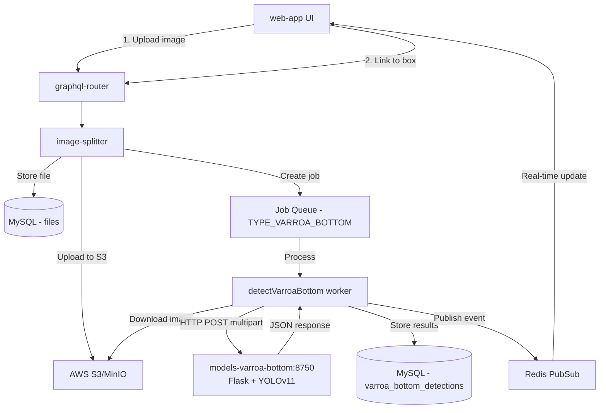

# models-varroa-bottom

Varroa mite detection service for Gratheon's hive bottom board analysis. This microservice provides a Flask-based HTTP API that uses YOLOv11-nano model to detect and count varroa mites in bottom board images.

## Architecture

This service is part of the Gratheon platform's varroa detection pipeline:



### Components
- **Flask HTTP Server** (`server_flask.py`) - Handles multipart/form-data uploads on port 8750
- **YOLOv11 Detection** (`detect.py`) - Runs inference using trained model
- **Model Weights** (`model/weights/best.pt`) - YOLOv11-nano trained on varroa mite images

### Model Parameters
- Confidence threshold: 0.1 (10%)
- IoU threshold: 0.5
- Image size: 6016 pixels
- Max detections: 2000 per image

## Deployment

### Docker (Development)
```bash
just start
```

Or manually:
```bash
COMPOSE_PROJECT_NAME=gratheon docker compose -f docker-compose.dev.yml up --build
```

### Docker (Production)
```bash
just start-prod
```

Or manually:
```bash
COMPOSE_PROJECT_NAME=gratheon docker compose -f docker-compose.prod.yml up --build
```

### Local Development
```bash
pip install -r requirements.txt
python server.py
```

The server will start on **port 8750**.

## API Documentation

### Endpoint: `POST /`

**Request:**
- Method: POST
- Content-Type: `multipart/form-data`
- Body: Form field named `file` containing the image

**Example using curl:**
```bash
curl -X POST -F "file=@your_image.jpg" http://localhost:8750
```

**Example using Python:**
```python
import requests

with open("sticky_sheet.jpg", "rb") as f:
    response = requests.post("http://localhost:8750", files={"file": f})
    data = response.json()
    print(f"Found {data['count']} varroa mites")
    for detection in data['result']:
        print(f"  - Confidence: {detection['confidence']:.2f} at ({detection['x1']:.0f}, {detection['y1']:.0f})")
```

### Response Schema

**Success response with detections:**
```json
{
  "message": "File processed successfully",
  "count": 8,
  "result": [
    {
      "x1": 2193.93,
      "y1": 3836.99,
      "x2": 2257.26,
      "y2": 3905.64,
      "confidence": 0.9389,
      "class": 0,
      "class_name": "varroa_mite"
    }
  ]
}
```

**Response with no detections:**
```json
{
  "message": "No varroa mites detected",
  "result": [],
  "count": 0
}
```

**Response Fields:**
- `message` (string): Human-readable status message
- `count` (integer): Number of varroa mites detected
- `result` (array): List of detection objects
  - `x1`, `y1` (float): Top-left corner coordinates in pixels
  - `x2`, `y2` (float): Bottom-right corner coordinates in pixels
  - `confidence` (float): Detection confidence score (0.0 to 1.0)
  - `class` (integer): Class ID (always 0 for varroa_mite)
  - `class_name` (string): Class name ("varroa_mite")

**Error responses:**
```json
{"message": "Missing 'file' field in form data"}
{"message": "No file selected"}
```

## Testing

### Quick Test
```bash
just test
```

Or manually:
```bash
curl -X POST -F "file=@Sample images/IMG_6098.jpg" http://localhost:8750
```

### View Logs
```bash
just logs
```

## Development Commands

Available `just` commands:
- `just start` - Start development environment
- `just start-prod` - Start production environment
- `just stop` - Stop development environment
- `just stop-prod` - Stop production environment
- `just run-local` - Run server locally without Docker
- `just test` - Test server with GET request
- `just logs` - View container logs

## Integration with Gratheon

This service is called by the `image-splitter` service when processing bottom board images:

1. User uploads bottom board image via `web-app`
2. `graphql-router` routes request to `image-splitter`
3. `image-splitter` stores file and creates `TYPE_VARROA_BOTTOM` job
4. `detectVarroaBottom` worker downloads image and calls this service
5. This service returns detection results
6. Worker stores results in MySQL and publishes event to Redis
7. `web-app` receives real-time update via WebSocket subscription

See [Varroa Bottom Detection Documentation](https://github.com/Gratheon/gratheon/blob/master/docs/web-app/features/varroa-bottom-detection.md) for full technical details.

## Configuration

### Network Modes
- **Development**: Default Docker bridge network (service accessible via `models-varroa-bottom:8750`)
- **Production**: Host network mode (`localhost:8750`) - configured in `docker-compose.prod.yml`

### Environment Variables
- `ENV_ID`: `dev` or `prod` (set in docker-compose files)

## Performance

- Processing time: 5-15 seconds per image on CPU
- Memory usage: ~2 GB RAM
- CPU usage: <10% during inference
- No GPU required

## Sample Images

Sample bottom board images are available in the `Sample images/` directory for testing.

## Upstream Project

This service is based on [VarroDetector](https://github.com/jodivaso/VarroDetector), an open-source tool designed to identify and count Varroa mites in images of sticky sheets. The original project includes a desktop GUI application and was created by researchers at the University of La Rioja and University of Zaragoza.

### Citation

If you use this detection model, please cite the original research paper:

Yániz, J., Casalongue, M., Martinez-de-Pison, F. J., Silvestre, M. A., Consortium, B., Santolaria, P., & Divasón, J. (2025). *An AI-Based Open-Source Software for Varroa Mite Fall Analysis in Honeybee Colonies*. Agriculture, 15(9), 969. https://doi.org/10.3390/agriculture15090969

```bibtex
@article{VarroDetector,
  title = {An AI-Based Open-Source Software for Varroa Mite Fall Analysis in Honeybee Colonies},
  volume = {15},
  ISSN = {2077-0472},
  url = {http://dx.doi.org/10.3390/agriculture15090969},
  DOI = {10.3390/agriculture15090969},
  number = {9},
  journal = {Agriculture},
  publisher = {MDPI AG},
  author = {Yániz, Jesús and Casalongue, Matías and Martinez-de-Pison, Francisco Javier and Silvestre, Miguel Angel and Consortium, Beeguards and Santolaria, Pilar and Divasón, Jose},
  year = {2025}
}
```

### Original Project Acknowledgments

The original VarroDetector research was funded by:
- Grant INICIA2023/02 by La Rioja Government (Spain)
- MCIU/AEI/10.13039/501100011033 (grant PID2023-148475OB-I00)
- The EU Horizon Europe (grant 101082073)
- The DGA-FSE (grant A07_23R)

&nbsp;&nbsp;&nbsp;&nbsp;&nbsp;&nbsp;&nbsp;&nbsp;

## License

This software uses a YOLOv11 nano model; thus, it is licensed under the GNU Affero General Public License v3.0 (AGPL-3.0).

